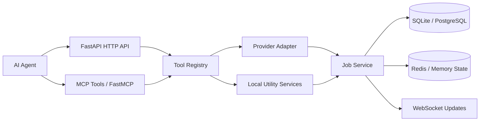

# Architecture

## Layers

1. **Transport layer**: FastMCP exposes MCP-native tools while FastAPI exposes operational HTTP endpoints.
2. **Registry layer**: `ToolRegistry` centralizes metadata, input schemas, and execution hooks.
3. **Workflow layer**: `WorkflowService` executes chained tasks with dependency-aware parameter resolution.
4. **Execution layer**: Provider adapters handle external media workflows; `AnalysisService` provides built-in text, speech, and document utilities.
5. **Persistence and state**: Durable job records live in SQLite or PostgreSQL; transient state is stored in Redis when available.
6. **Realtime observability**: WebSockets publish job-state changes, and `/metrics` exports lightweight Prometheus-friendly counters.
